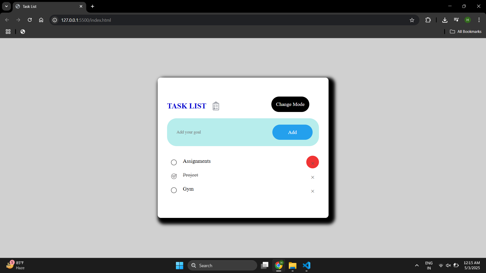
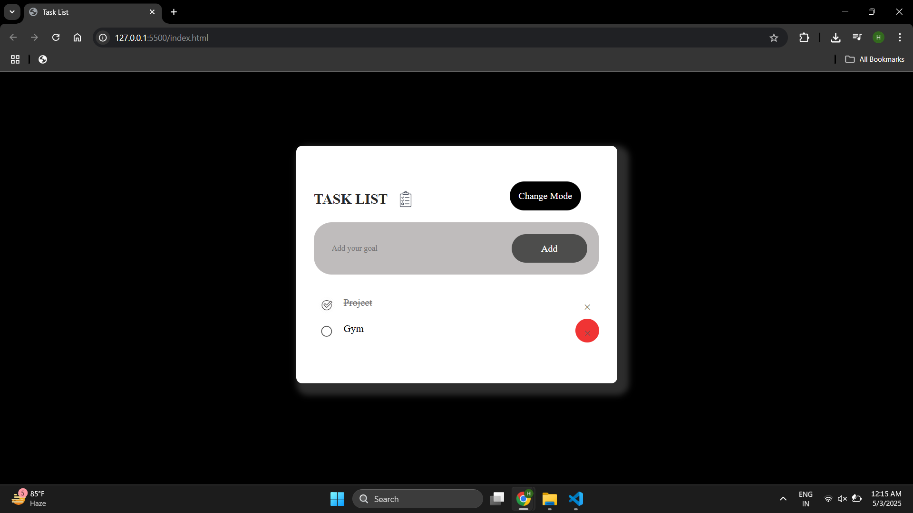

# Task List Applicaiton

Built a front-end task list application using HTML, CSS, and JavaScript with dynamic DOM updates, event handling for task management, local storage for data persistence, and a user-friendly light/dark mode toggle.

Screenshots of the Web Page are attached below:

